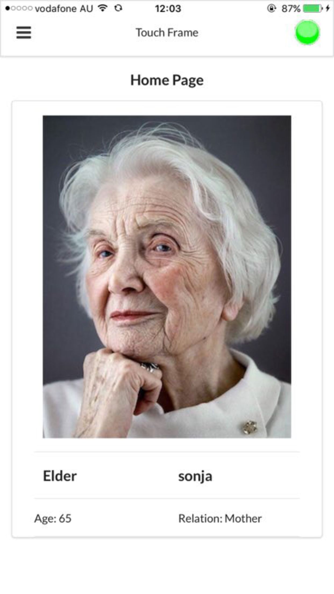
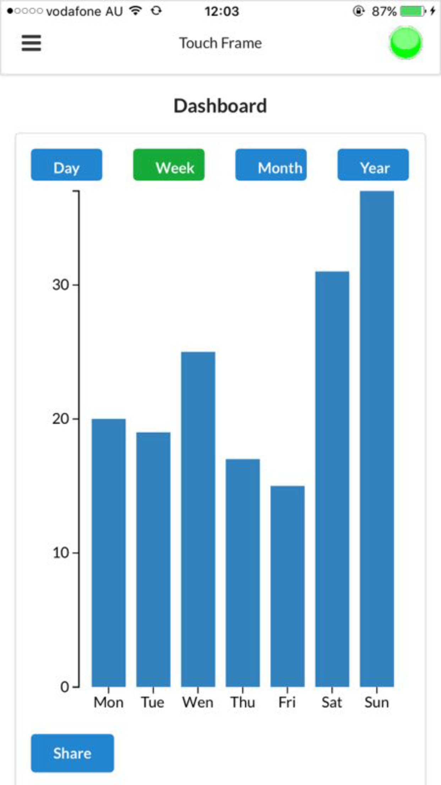
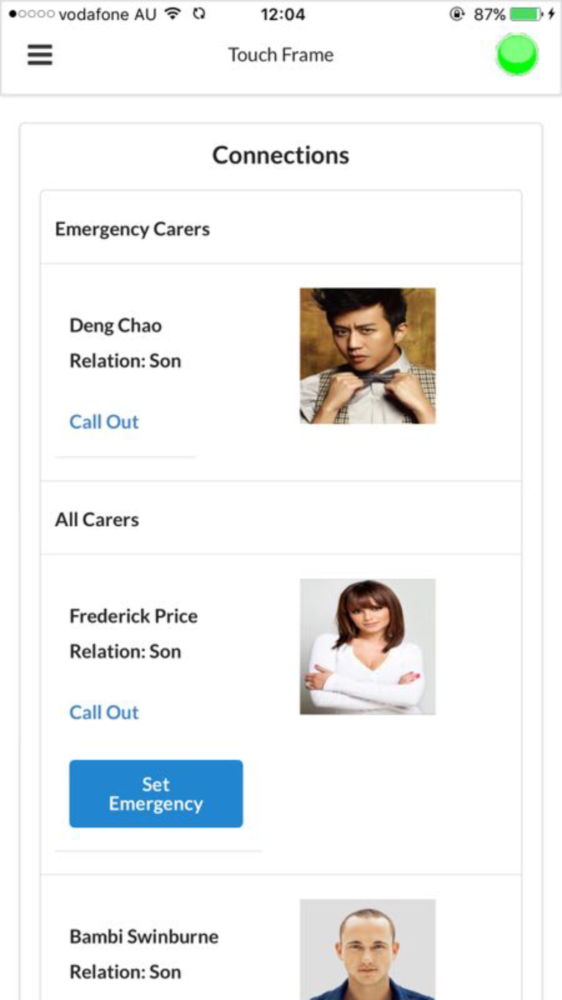
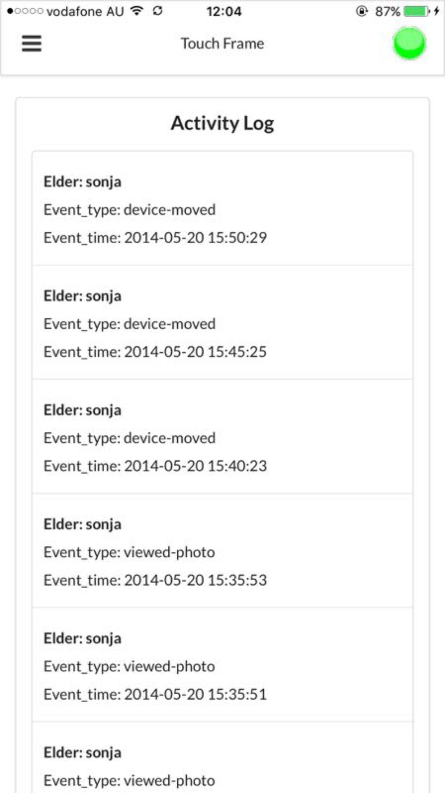
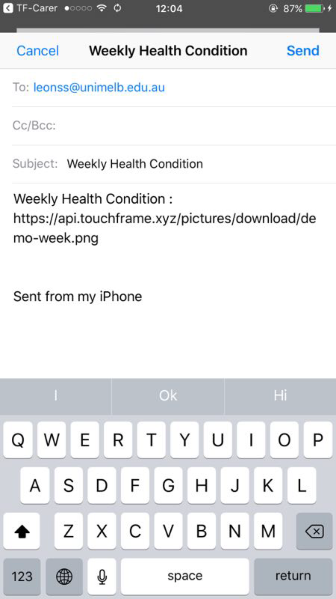
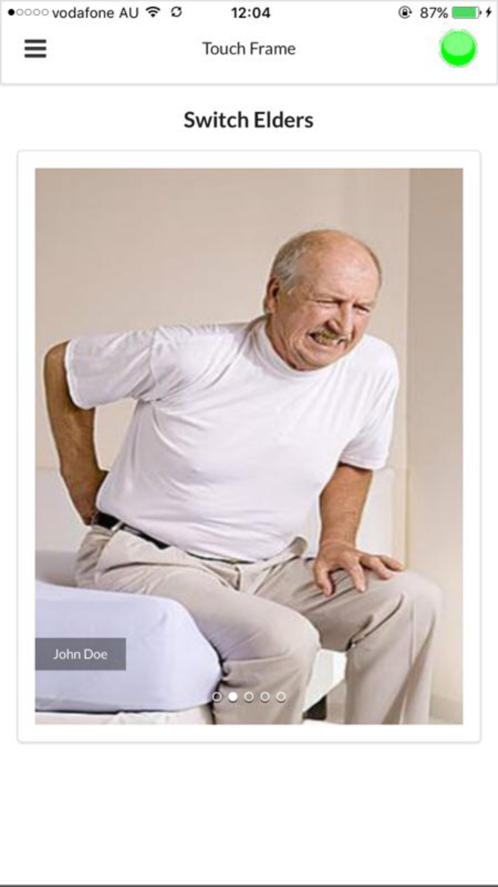

# Touch Frame
The Touch Frame application is a social networking app that connects families and ensures the safety of elder people in families. Our goal is to make life of families and elderly people happy, fun and enjoyable.

## Demonstration








# Knowledge Base
## Git
### Initializing the repository
```bash
# init local git repository, do this under the path/folder of where you want your local git source repository to be
git init .
# specify username and email
git config user.name "<your name>" # For example: git config user.name "Zeyu Ye"
git config user.email "<your email>" # For example: git config user.email "zeyuy@student.unimelb.edu.au"
#Turn off https verification
git config http.sslVerify false
# add the remote repository
git remote add origin https://"<your username>"@bitbucket.cis.unimelb.edu.au:8445/scm/~zeyuy/touchframe.git # For example: https://"<your username>"@bitbucket.cis.unimelb.edu.au:8445/scm/~zeyuy/touchframe.git
# pull from remote repository
git pull origin master
```

### Pushing changes
```bash
# add new files
git add .
# commit the changes
git commit -m "<message>" # For example: git commit -m "Bug fixes"
# push to remote repository
git push -u origin master
```
# All Contributors:
Zhenghui Xiang, Zeyu Ye, Dan Li, Kun Qin, Di Mao, Zheng Chai, Daniel Chiuchiarelli, Jime Smith and Xing Hu

